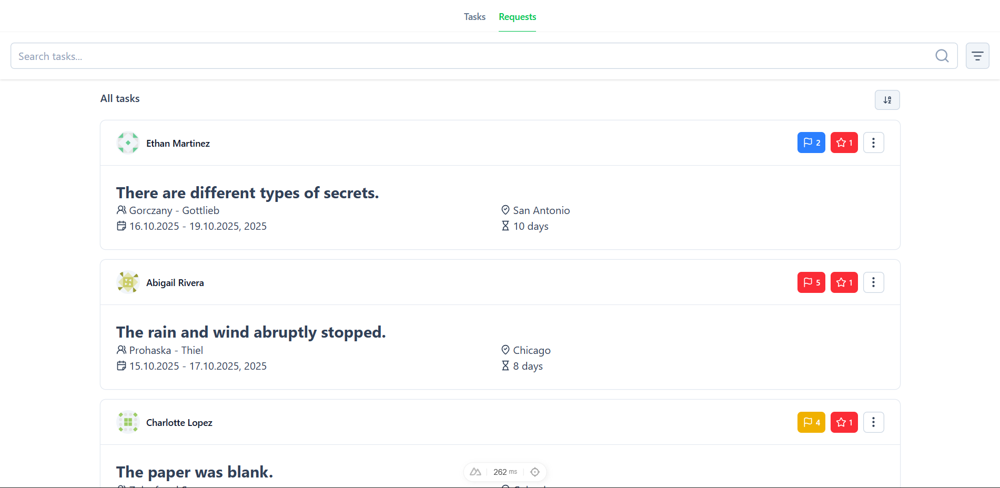
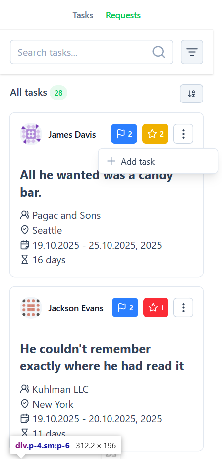
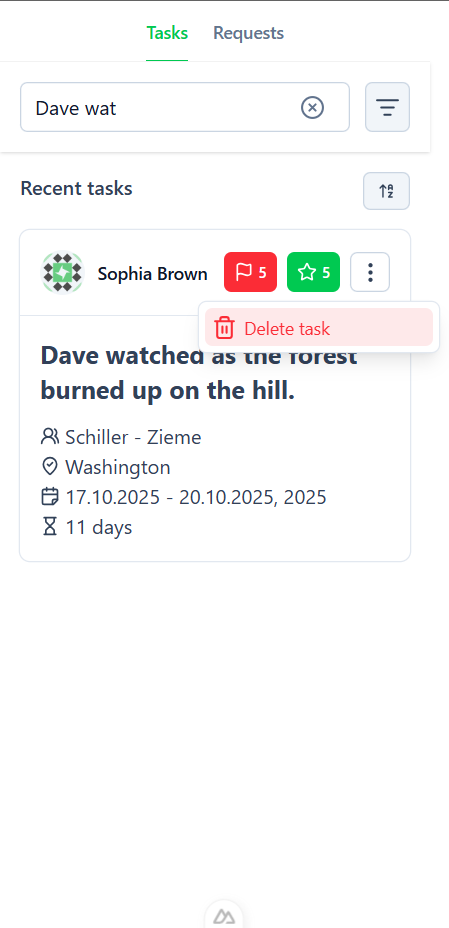
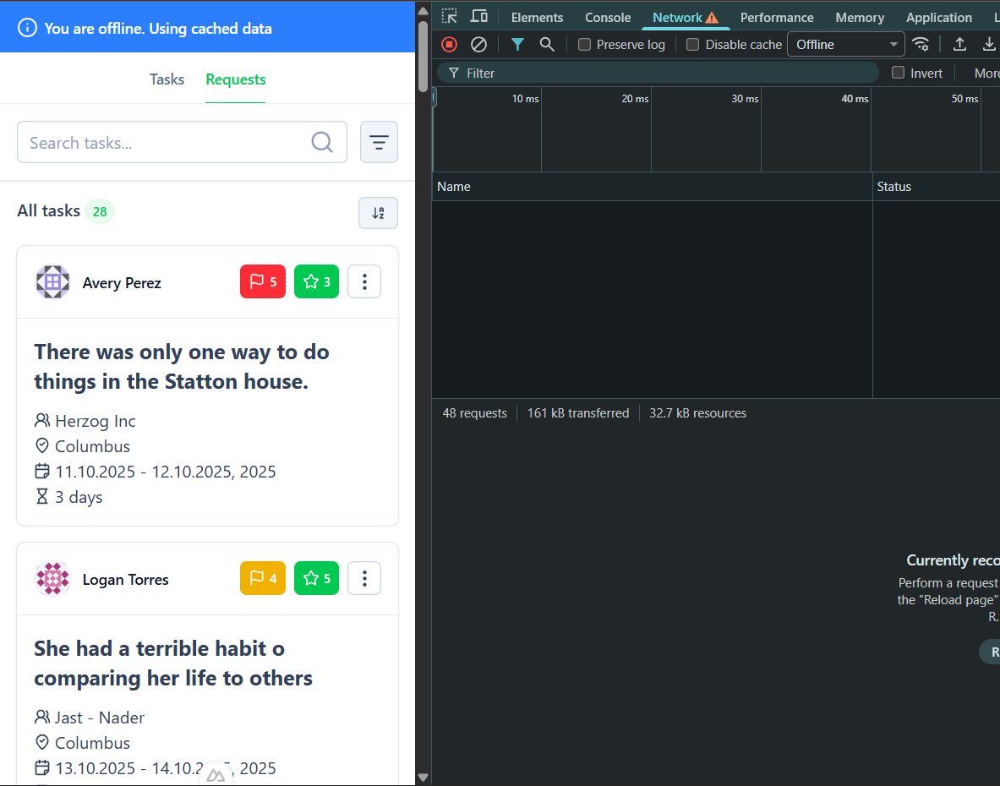
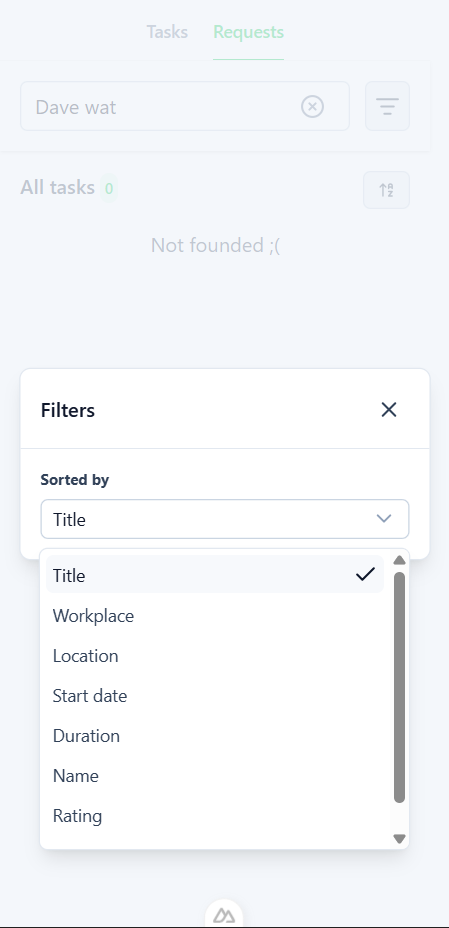

# 🧠 Task Management Test App

A small test project built with **Nuxt + TypeScript + Nuxt UI**.  
The app fetches tasks from a public API, stores them in **IndexedDB** for offline use,  
and allows users to manage, search, and sort them across two main pages.

---

## 🚀 Tech Stack

- **Vue 3**
- **Nuxt 4 (Nuxt UI v4)**
- **TypeScript**
- **Tailwind CSS**
- **IndexedDB** for local persistence
- **PWA / Offline support**
- **Vite** build system

---

## 📱 Description

_Example:_  
 

This application displays loaded task cards.  
All fetched data is saved locally in **IndexedDB**, allowing the app to work even when offline.  
Application can request more tasks at any time using the handler.

There are **two main pages**:

1. **Requests** — shows all fetched tasks.  
   _Example:_  
   

2. **Tasks** — shows tasks that were accepted into work.  
   _Example:_  
   

When the app is online, a banner appears to indicate the online status —  
and it remains visible even after page reloads.  
_Example:_  


---

## 🧩 Task Card Structure

Each card contains the following fields:

```ts
{
  id: string;
  name: string;
  avatar: string;
  rating:; // from 1 to 5
  urgency:; // from 1 to 5
  title: string;
  location: string;
  startDate: string;
  endDate: string;
  workplace: string;
}
```

---

## 🔍 Search & Sorting

```ts
// Search fields find any match in this fields:
[title, location, name, workplace];
```

Sorting keys:

_Example:_  


---
